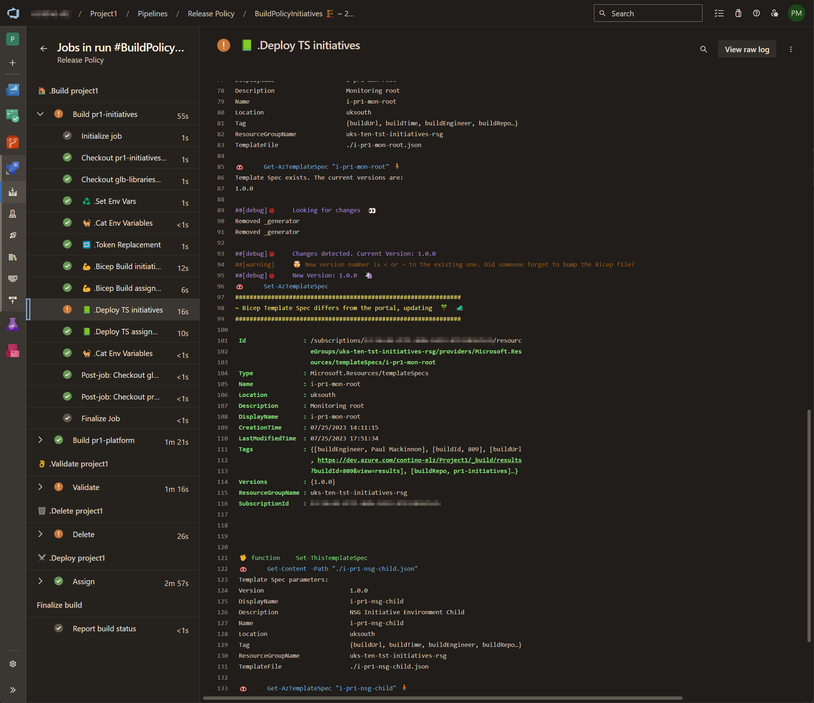

# Azure Policy Fully Automated Deployment

This project was born out of the desire to improve the labor-intensive policy rollout process across multiple projects, subscriptions, and management groups. The aim was to create a fully automated deployment process, which would enable the following:

- Utilisation of a single resource group as the source for policy definitions for all projects.
- Use of a single pipeline to deploy all policies for each project.
- Creation of a Template Spec file using Bicep for each policy definition, initiative, and assignment.
- Implementation of versioning within the Bicep file to track code development and changes, which will reflect in the Template - Spec file and policy versions.
- Facilitation of policy updates without the need to remove and redeploy the policy where applicable.
- Minimisation of downtime for policies that do require removal and redeployment.
- Deployment of policies at both the management group and subscription levels.
- Deletion of Template Specs and removal of policies when the code has been eliminated from the repository.

After much research and testing, I discovered that only when a policy input parameter has been changed does it require a removal and redeployment of the definition, intiative and assignment. This implies that if the content of the policy remains unaltered, it can be updated in place, thereby minimising the downtime of deployed policies. However, in case the policy does need to be removed, we can target the linked assignments and initiatives specifically, remove them in order, and then re-publish the definition, initiative, and assign them.


_The following diagram illustrates the process flow for the deployment of policies:_


## Structure


In this scenario, we assume the existence of one _Global_ project that serves as a shared service for all project resources, following a hub and spoke topology. This Global project acts as a central location for logs, key vaults, policies, etc. The policy definitions will be deployed from this Global project and will be consumed by the attached spokes and hub (referred to as _Project1_).

_Project1_ will have its own specific policy initiatives and assignments that are tailored to the project and not shared with other projects. Additionally, it will have its own _platform_ subscription, which is specific to the project and not shared. Subscription-level initiatives and assignments are consumed from this project-specific subscription.

I am using a subscription within the _Global_ project as the source to contain the Template Specs for all the policies. This is to ensure that all policies are deployed from a single location and that the source is not spread across multiple projects. This subscription is referred to as the _ten-glb-ssv-ts_.

A quick note on naming conventions:

| Prefix | Description |
| ---    | ---         |
| glb    | Global environment                                                |
| tst    | Test environment                                                  |
| pr1    | Project1-type sub                                                 |
| ten    | Global-type sub in Tenant 'ten' (others could include ppd or prd) |

I am utilising several service principals linked to service connections within Azure DevOps. Each service principal and service connection (SP/SC) has specific permissions assigned to perform particular actions at the designated scope. This approach aims to limit the potential impact in case an SP/SC is compromised. In saying that, please do note that my codebase only refers to a limited set of SP/SC's just because I'm lazy and didn't want to redo all the permissions for this demo. Please do make sure you **don't** do this yourself in a production environment.

_The following table outlines the SP/SCs and their permissions:_


## Repository Structure

Each repository is prefixed with an acronym matching that of the project it belongs to. This ensures that each repository will reside within its corresponding Project level structure in Azure DevOps. Only the _glb-libraries_ repository will be accessible to all projects, as it contains the pipeline codebase and scripts in a central location.

I'm quite meticulous when it comes to file structure and naming conventions. I have found that maintaining consistency in both of these aspects greatly facilitates coding, as well as navigation and comprehension for newcomers. Consequently, you will observe that I utilise patterns in my naming conventions that directly correspond to the folder structure of the files. Deviating from this convention could result in issues, particularly since I heavily rely on regex.


#### glb-policy:

Contains all the policy definitions for which all projects consume

```
.
└── glb-policy
    ├── bicep
    │   └── definitions
    │       ├── afw
    │       │   ├── p-glb-afw-apprule-allowed-ports.bicep
    │       │   ├── p-glb-afw-apprule-allowed-ports.bicep
    │       │   └── p-glb-afw-diagnostic-settings-dine.bicep
    │       ├── gen
    │       │   ├── p-glb-gen-allowed-locations.bicep
    │       │   ├── p-glb-gen-allowed-resource-types.bicep
    │       │   └── p-glb-gen-deny-resources-without-tags.bicep
    │       └── nsg
    │           ├── p-glb-nsg-any-in-destination.bicep
    │           ├── p-glb-nsg-any-in-ports.bicep
    │           └── p-glb-nsg-any-in-source.bicep
    ├── params
    │   ├── ten (tenant, ie; dev/ppd/prd)
    │   │   └── config.yml
    │   ├── ppd
    │   └── prd
    └── pipelines
```


#### glb-initiatives:

Contains the shared services (global) initiatives and assignments

```
.
└── glb-initiatives
    ├── bicep
    │   ├── assignements
    │   │   └── main.bicep
    │   └── initiatives
    │       ├── i-glb-gen-root.bicep
    │       └── i-glb-nsg-child.bicep
    ├── params
    │   ├── ten (tenant, ie; dev/ppd/prd)
    │   │   ├── assignments
    │   │   │   └── global (mgmt group)
    │   │   │       ├── default.json
    │   │   │       ├── glb-gen-root.json
    │   │   │       └── glb-nsg-child.json
    │   │   └── config.yml
    │   ├── ppd
    │   └── prd
    └── pipelines
        └── release.yml
```


#### pr1-initiatives:

Contains the project1 initiatives and assignments

```
.
└── pr1-initiatives
    ├── bicep
    │   ├── assignements
    │   │   └── main.bicep
    │   └── initiatives
    │       ├── i-pr1-gen-root.bicep
    │       ├── i-pr1-mon-root.bicep
    │       └── i-pr1-nsg-child.bicep
    ├── params
    │   ├── tst (environment)
    │   │   ├── assignments
    │   │   │   └── project1 (mgmt group)
    │   │   │       ├── default.json
    │   │   │       ├── pr1-gen-root.json
    │   │   │       ├── pr1-mon-root.json
    │   │   │       └── pr1-nsg-child.json
    │   │   └── config.yml
    │   ├── ppd
    │   └── prd
    └── pipelines
        └── release.yml
```


#### pr1-platform:

Contains specific subscription level initiatves and assignments

```
.
└── pr1-platform
    ├── bicep
    │   ├── assignements
    │   │   └── hubPlatform.bicep
    │   └── initiatives
    │       └── hubPlatform.bicep
    └── params
        ├── tst (environment)
        │   ├── 01 (hub number)
        │   │   └── assignments
        │   │       └── hubPlatform.json
        │   └── config.yml
        ├── ppd
        └── prd
```


#### glb-libraries:

A central location for all shared deployment code

```
.
└── glb-libraries
    ├── pipelines
    │   └── pipeline codebase
    └── scripts
        └── pipeline scripts codebase
```


## Execution

After all that explanation I guess this part is relatively easy. Once all the code is in place the deployment process is as simple as running the pipeline(s).

1. Run the definition pipeline to deploy the Template Specs to a shared resource group.
2. Run each of the project-level pipelines to deploy the initiatives and assignments.

Essentially what will happen is that any definition, initiative or assignment that has changed (edited or deleted) will automatically get rectified in each of the corresponding pipelines.

- If a policy has been edited, the Bicep file will be updated, the Template Spec will be updated, and the linked polidies will be updated.
- If a policy has been deleted (the Bicep file deleted), the Template Spec will be deleted, and the linked polidies will be deleted.
- If a policy has been added (the Bicep file added), the Template Spec will be added, and the linked polidies will be added.
- We continuously publish policies regardless if they already exist
    - If they exist they will overrride the existing policy in Azure; which works because there is no change
    - If they were altered they would have been removed before we get to the publish stage, so no overriding isuses exist

Once in place this could essentially be maintained and run by a Cyber team with limited coding experience. All they would need to maintain would be the Bicep files and their associated parameter JSON files. To take this a step further and show a consistent code development flow, I would recommend including automatic PR and repository tagging, for which I've already written about here: https://paul-mackinnon.medium.com/azure-devops-tagging-bcd0833fafae


## The Cool Stuff

I'm not going to go into too much detail here, but I do want to highlight some of the cool stuff that I've done in this project.


#### PowerShell Threading

I've utilised PowerShell threading to speed up the deployment process, as shortly after testing out my code on a large set of policies I found that the time to deploy each individual policy was quite long. However once parallelism had been enabled, for roughly 100 policy definitions I've seen the Bicep files built and Template Specs deployed within a few minutes (2-3) for the entire pipeline; which isn't that bad. I also found that when I used the `az bicep build` command to build the Bicep files it would download the binary file each and every time, which obviously added up the time. I soon discovered that the Bicep binary was built into the AzCLI task, and so instead I could just do `bicep build` and massively speed up the deployment.

Publishing, or deploying the Template Specs to Azure Policy also uses threading, and during development I found some weird issues when trying to deploy both at subscription and management group level at the same time. Sometimes during the assignments stage I would get a weird error that the Template Spec could not be found to deploy, but it did exist! To be honest it took quite a while to debug and figure out what the issue was; as it turns out running threading in PowerShell may spawn up a new thread, but it's a thread of the current process; so when I was performing a `Select-AzContext -Scope "Process"` command it was not only doing the change for the current thread, but all the others running. To get around this I was able to export and rename all the current Azure contexts and then selectively choose which one I was to use for each thread based upon the name of the assignment; basically pointing the deployment to a target subscription without switching contexts.


### Dynamic Variables

I came up with this idea quite a while before this project to dynamically generate a list of variables that could be used in a token/replacement script to save hardcoding some values, like subscription ID. This way you can pre-develop a lot of your code by relying upon naming conventions to populate expected variable values. Horrah for Azure Resource Graph Explorer and regex! Quite handy when you're deploying production and would normally have to rely on Pull Requests to change a variable value.


### Multiple config.yml File Variables

When pulling in multiple repos for deployment and having files that match a consistent naming convention it caused havoc with my variable files; each one would override the existing values. In order to get around this I created a script (partly ripped off from my colleague.... :| ) that would locate these files and dynamically generate the variables at their own job level, as so they wouldn't intervene with the other jobs. This way I could have a config.yml file for each repo and not have to worry about them overwriting each other.


## Misc Screnshots and Whatnot

There's a lot of screenshots here, and I've ordered them in such a way the deployment process would go, highlighting specific ones to get the jist of it all.


### Global Project ~ Build Pipeline

We first need to Bicep build and deploy all the definitions to a root resource group for consumption by other projects. This will ensure a single source of truth that could be maintained by a security or governance team.

Note; To prevent a constant bumping of the Bicep/Policy version during development, the deployment code has been designed in such a way that it will create a WARNING to notify you of these changes, but in Production it will cause the pipeline to fail and stop. This is to ensure that the Bicep/Policy version is only bumped when it's ready to be deployed to Production.


#### ...and when a change has happened:


#### ...and when a change has happened on a BRANCH:


### Global Project ~ Release Pipeline

The Global project maintains subscriptions within its shared service type management group(s), things like secops, "management" and shared resources like image factories and the like.


### Project1 ~ Build Pipeline

Project1 is essentially the project containing the hub. You can spawn off other projects would act as spokes and name them accordingly (Consumer1, Consumer2, etc...). I've only done one project/sub to simplify my demo.


#### ...and when a change has happened:


#### ...and when a change has happened on the main branch but the version has not been bumped:


#### ...and when a change has happened on a BRANCH:





### Azure Portal Resources

Misc Azure resources to show what they would look like in the GUI. I sometimes struggle understanding until I "see" them for myself, so I hope this helps. You can see the deployments at management group level, suffixing each deployment with the Azure DevOps build ID so you can easily identify its source.


### Azure DevOps Settings

Don't forget to add approval requirements on each environment your pushing the deployment through. Here I'm just showing approvals for the deletion environment, but in Production we would have it on every stage as well as branch control ensuring that code is only deployed from the main branch, or a release tag.


You'll need to enable cross-project repository access in order to utilise `glb-libraries` from project1 and other projects.


## Conclusion

There's a lot of code that I've shared out, and I could go into a lot of detail if I couldl; but I'm not that kind 'effort' guy. The code should speak for itself as I've commented on it in a lot of places. I hope you find this deployment method interesting, and/or this code useful. I don't pretend that I've invented the most awesome'est thing in the world, or that it's better than anyone else's. I just wanted to share my work and hopefully help someone else out there that I thought was cool. If you have any questions, please feel free to reach out.